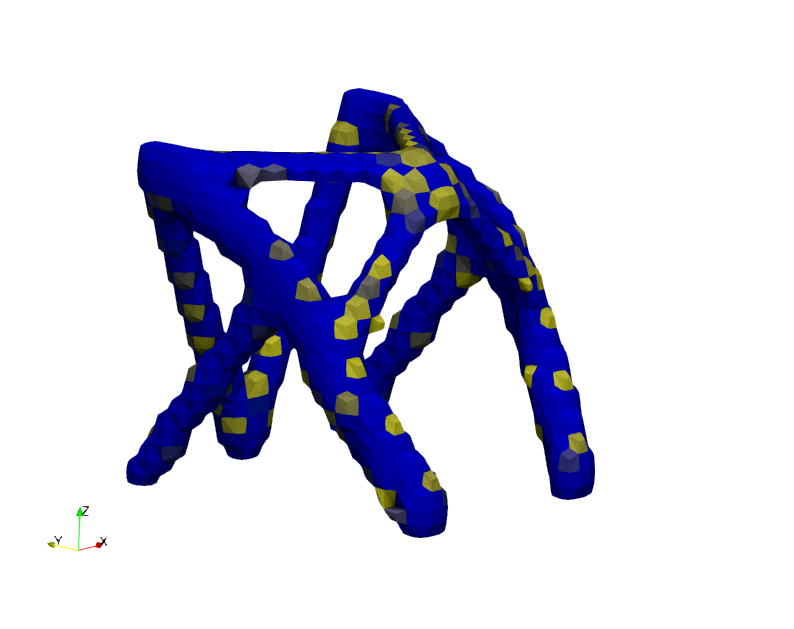

# <3IGEN

This repository contains a rough implementation of a standard finite element program (aimed basic linear 3D elasticity problems) utilising [Eigen](https://eigen.tuxfamily.org/index.php?title=Main_Page), a (header only) C++ template library for linear algebra. (The most recent implementation of the program, captured here, is tested with 3.4.0.) See the Wiki [page](https://en.wikipedia.org/wiki/Eigen_(C%2B%2B_library)) of Eigen, with links to explanations of expression template metaprogramming techniques, expression trees, loop unrolling and vectorization, _etc_..

An example _Makefile_ is included, with the authors' specific paths _etc_. hard-coded. Compilation with header only libraries is of course, in general, relatively easy (compared to _e.g._ PETSc). Currently the program also relies on a header only JSON input reader, provided [here](https://json.nlohmann.me/integration/) (the single _hpp_ file provided). A typical complication command on a Linux system may take the following form

> `g++ -fopenmp -O2 -I PATH_TO_EIGEN_DIRECTORY -I PATH_TO_JSON_READER_DIRECTORY main.cpp read_json.cpp wrte_lvtk.cpp dmat.cpp smat.cpp scg.cpp  -o main`

The code is then executed with, for example

> `./main 16 1 sample.json`

wherein _1_ is a flag which indicates what linear solver will be used (details below), and _16_ indicates the number of sharded memory (openmp) threads. Eigen automatically uses multi-threading for some [operations](https://eigen.tuxfamily.org/dox/TopicMultiThreading.html). Some initial timing tests are given below.

 A JSON input deck containing node, element, material, loads and boundary condition specification (see _make_test.py_ for creation of a basic grid in a programmatic manner). The format is taken from an example code of [Aragon](https://www.tudelft.nl/staff/a.m.aragon/?cHash=23ad70006635654bbc79d16b98d92f29), as communicted in his course on Advanced Finite Element Methods (TU Delft, 2023). It should be noted that the fact that the example mesh (generation) is a 'structured grid' is not exploited anywhere in the program (for we wish to implement unstructured tetrahedrons as well).

The sparse global stiffness matrix is constructed from a list of triplets, as created during the assembly loop. Element-level dense matrix operations (to arrive at an individual elements stiffness matrix) is done with (seemingly efficient) Eigen matrix-matrix operations

 > `kay_e = D.transpose() * S * D`

with the integration point weights/volumes (and/or Jacobian determinants) written into a generalised constituitive matrix _S_. To be clear, _S_ contains a copy of the 'normal' constituitive matrix for each integration point, but scaled by the integration constants. Similarly, the matrix _D_ is a concatenation of the '_B_' matrix, as typically seen in monographs on finite element techniques, at each itegration point. The implementation used here is taken from [van Keulen's](https://www.tudelft.nl/staff/a.vankeulen/?cHash=d26846246f93aebc120c44adeccaa31a) presentation of the subject in his course on Continuum Mechanics (and the associated generalised discrete representation) (TU Delft, 2017).

The solver options (currently implemented) are as follows

- _0_ : Eigen native direct (LDLT) factorisation and solve
- _1_ : A rendition of the diagonal scaling conjugate gradient method of Dhondt as provided in [CalculiX](http://www.calculix.de/). As far as possible the operations have been modified so that Eigen's efficient (and multi-threaded) handling of sparse matrix-vector products is exploited.
- _2_ : A rendition of the incomplete Cholesky preconditioned conjugate gradient method of Dhondt as provided in [CalculiX](http://www.calculix.de/). The preconditioner seems to work very well, however, as of yet, the author has not been able to easily implement it in a manner which exploits Eigen's data structures and formats, hence multi-threading is not exploited in the construction of the preconditioner (and in fact the back-substituitions). 
- _3_ : Eigen native diagonal scaling conjugate gradient method, specified such that multi-threading is employed. We see similar perforamnce compared to (1).

The table below contains time required to solve a linear system which arises from of a linear elasticity problem of 150 &times; 150 &times; 150 Hexahedron elements---about 10 million degrees of freedom. We have conducted initial tests on both the Delftblue and PME (HPC6) clusters. The diagonal scaling CG method benefits if multiple threads are available, while, in its current form, the incomplete Cholesky preconditioned version does not. (The time required is nevertheless impressive, given the small number of threads.) For all the tests 64 Gb of RAM memory was reserved.

| Platform &nbsp; &nbsp; &nbsp; &nbsp; &nbsp; | Solver &nbsp; &nbsp; &nbsp; &nbsp; &nbsp;  | Threads &nbsp; &nbsp; &nbsp; &nbsp; &nbsp;  | Time (s)   |
|:------------|:--------|:---------|---------:|
| DelftBlue   | 1       |        1 |     1445 |
|             |         |        2 |      817 |
|             |         |        4 |      532 |
|             |         |        8 |      334 |
|             |         |        16|      334 |
|             |         |        32|      267 |
| PME (HPC06) | 1       |        1 |     1447 |
|             |         |        2 |     1130 |
|             |         |        4 |      774 |
|             |         |        8 |      658 |
|             |         |        16|      544 |
|             |         |        32|      333 |
|             |         |        64|      289 |
| DelftBlue   | 2       |        1 | 286+323  |
|             |         |        2 | 264+234  |
| PME (HPC06) | 2       |        1 | 234+328  |
|             |         |        2 | 234+307  |

- Small scale examples have been verified against CalculiX&mdash;see _vav_.

- A simple topology optization code, in this frame, is in work.

